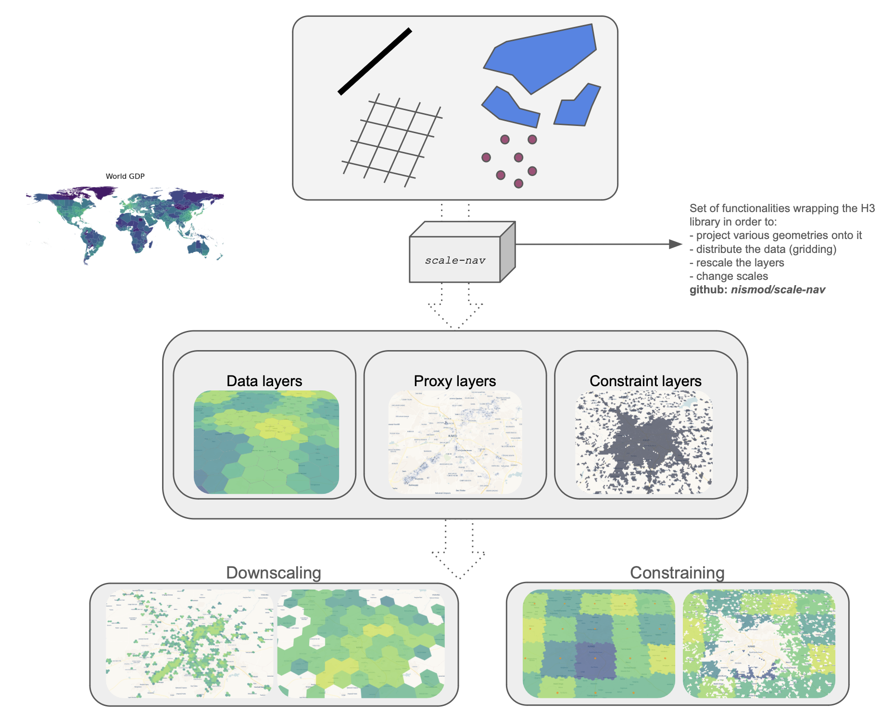
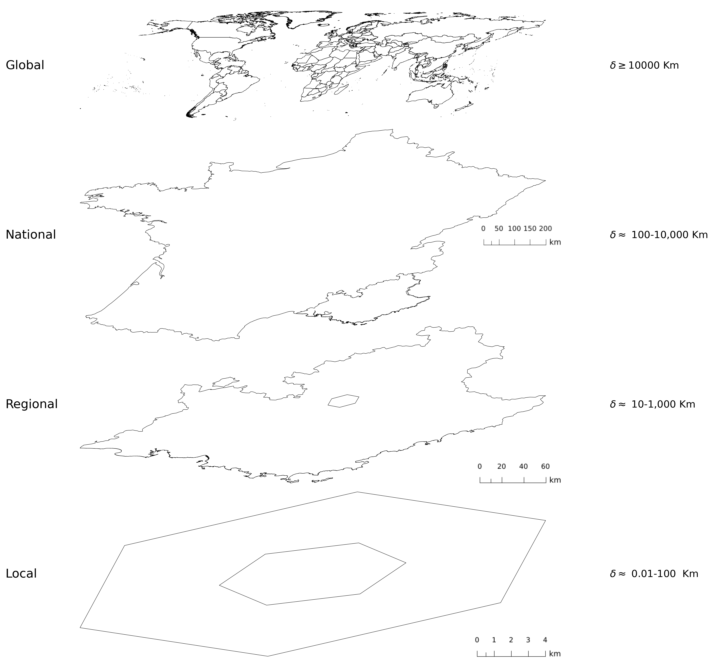
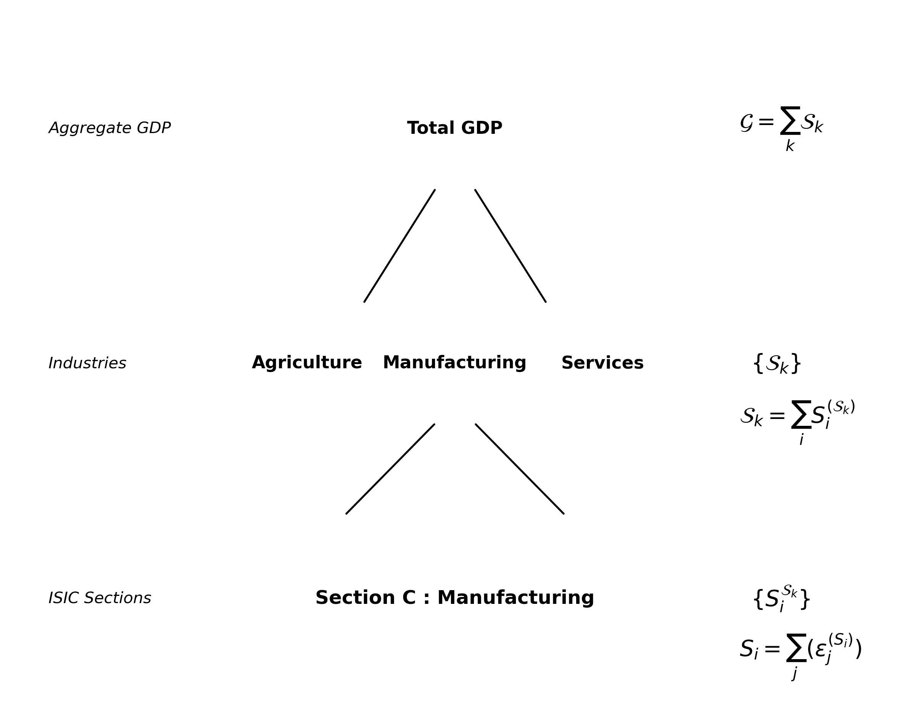
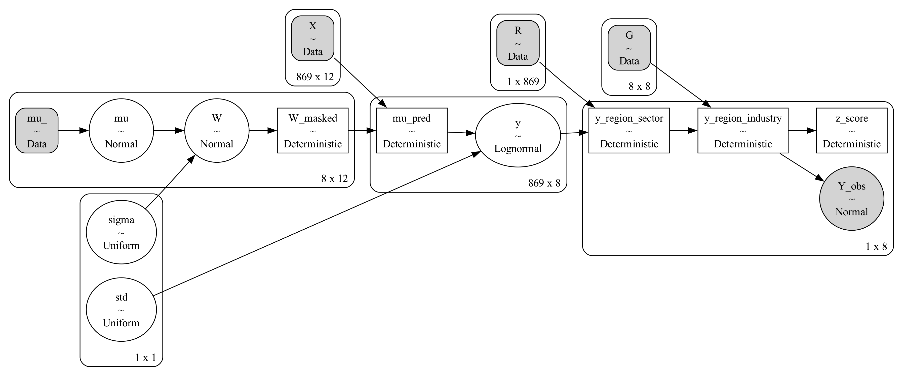

# Economic activity and trade

In order to understand the finer geographical scale at which the economy is organised, we introduce modelling methods allowing to disaggregate reported national statistics for economic output onto a fine spatial indexed grid. The methodology fits into the inverse problem theory, in this context the modeller takes observed data and attempts to build a model that produces this data under some constraint and sometimes limited prior knowledge about a pheomenon. In the following sections, the model, input data and output schema will be described. 

## Data

The input data come from various sources including academic, open source, crowd sourced, and official accounts. The full list has been put together into a catalogue available upon request. The econometric model uses OvertureMaps as it's primary source of points of interest (POIs), for which the exact coordinates and a categorical classification are known, the

# Methods

<!-- 

General flow for this section:

inverse problem theory -\> bayesian approach, hierarchical

Bayesian methods have found a very wide range of applications in particular inverse problems.

\- Bayesian modelling - Inverse problems - Managing the different scales - Using sampling to produce 'scenario' like outputs that are combined with likelihood - Software implementation with scalenav, pymc

[@totoBayesianPredictiveInference2010] 

-->

## Process

The method involves three main steps:

- Data Collection and Preprocessing: data are downloaded, transformed into consistent file formats, and allocated to spatial units, providing proxies, priors and constraints for the modelling.
- Downscaling: a Bayesian hierarchical model integrates geospatial variables (e.g., population density, infrastructure distribution, night-time light emissions, and land use classifications) and coarse-resolution constraints on spatial, sectoral economic activity.
- Validation: datasets representing aggregations of spatial, sectoral activity, some with limited geographical coverage, are used to validate our downscaled economic distributions.

There are multiple sources for global data covering different sectors of economic activity and physical features, available at different resolutions, covering different time periods, and provided in different formats and coordinate systems.

Inputs are taken from: multi-regional input-output tables for national, sectoral production[@lenzenGlobalMRIOLab2017], non-residential built-up area [@europeancommission.jointresearchcentre.GHSLDataPackage2023], and points of interest and land use from Overture Maps[^1] and OpenStreetMap[@OpenStreetMap].

Validation data sets include: combined national/sub-national sectoral value added from the World Development Indicators[@WDI], the CIA World Factbook[^2], [@wenzDOSEGlobalData2023] and the US Bureau of Economic Analysis[^3] county level economic activity.

Data is projected onto the H3 grid[^4]. Raster data cell centroids are projected onto H3 at a resolution higher than the raster cell size, then a Voronoi tessellation fills any gaps in the H3 grid. Points are allocated directly to their H3 cell. Polygons are allocated to all contained H3 cells. The resolution for projection of vector features is chosen to cover the equivalent of a small building block, $\approx 100$ meters.

The multi-faceted nature of the problem, which takes into account prior knowledge on the spatial locations, general law of distribution of economic output, as well as expert knowledge on certain sectors naturally fits into a Bayesian framework. A Bayesian hierarchical model (BHM) [@songBayesianHierarchicalDownscaling2014] allows modelling complex phenomena relying both on prior information, which can be obtained by the modeller from a mix of expert sources, but also integrate a stochastic approach to parameter exploration. The model step is realised by running a Markov Chain Monte Carlo (MCMC) process, leading to a posterior distribution. The output of this process incorporates our prior beliefs and adjusts them based on likelihoods given observed data.

The core of the model can be summarised as follows:

$$
\mathbf{W} = SkewNormal(\mu,\kappa)
$$

$$
\mathbf{Y} = LogNorm(\textbf{W} * \textbf{X},\sigma)
$$

Where $W$ is the matrix of econometric weights for which the mean($\mu$) and standard deviation($\kappa$) are fixed using available information on the input proxy data and the constraints, $X$ is a matrix of proxy variables index representing rescaled and normalised input proxy data, $Y$ is a matrix containing per sector per location output samples, $\sigma$ is the uncertainty, taken as a fixed fraction of the lognormal mean. This sampling is performed under the following constraints:

$$\sum_{i\in \mathcal{G}_{\lambda},j\in \mathcal{S}_{\zeta}}\textbf{Y}_{ij} = \mathcal{V}^{(\lambda \zeta)}
$$

where $\mathcal{G}_{\lambda}$ is a unit of the geographical constraint, $\mathcal{S}_{\zeta}$ is a unit of the sectoral constraint, and $\mathcal{V}^{(\lambda \zeta)}$ is the corresponding region and sector aggregated value at the resolution of the constraint.

## Spatial Representation and Indexing

<figure id="hierarchies">

 

<figure id="spat_hierarchy" style="margin: 0; max-width: 45%;">

 

</figure>

<figure id="sect_hierarchy" style="margin: 0; max-width: 45%;">

</figure>

<figcaption> Spatial and Sectorial hierarchies </figcaption>

</figure>

## Pycnophylactic Condition

\- From a strict conditioning[@toblerSmoothPycnophylacticInterpolation1979], to a flexible one allowing for an uncertainty on the reported macro level data, and less penalising for the model.

The macro level data, expressed as a sum of micro level observations combined :

$$
G = \sum_j S_j
$$

$$
\hat{G} \sim  \mathcal{N}(G, \sigma_G)
$$

$\sigma_G=0.1*G$ allowing for a standard deviation of $10\%$ of the observed value. In this formulation, the observed reported is interpreted as the expected value of a normal distribution.

$$
E[\hat{G}] = G
$$

$$
\hat{S_j} \sim LogNorm(\mu_{S_j}, \sigma_{S_j})
$$

The constraint is implemented through the use of aggregation operators, $G$ and $R$, that perform the necessary spatial and sectorial aggregation to obtain a constraint resolution level value of the output. This value can then be checked against the constraint.

$$
R\equiv \{r_{ij}\} = \begin{cases} 
1 & \text{if location j is in region i} \cr 
0 & \text{if not} 
\end{cases}
$$

$$
G\equiv \{g_{ij}\} = \begin{cases}
1 & \text{if sector j is part of industry i} \cr 
0 & \text{if not}
\end{cases}
$$

The successive application of these aggregation operators to an output tensor ($n \_ locations\times n \_ sectors$) provides a tensor containing modelled outputs aggregated to the same spatial and sectoral resolution as the constrain. At this level of resolution, the likelihood function can be applied and comparison can be made with the available data.

## Spatial modelling

## Bayesian Modelling

## Econometrics

### Traditional proxies

Very common in the spatial econometric literature is the use of night time lights (NTL) as a proxy for the intensity of economic activity, this

[@anselinSpatialEconometrics1988]

$$
Y_i \approx \sum_k w_k X_k
$$

$$
\omega_k \sim \mathcal{N}(\mu_W,\sigma_W)
$$

Visually, the model is represented as follows :

## Expanding the baseline model

When additional data is availbale, it can be used to either validate sectorial level outputs, or become part of the prior.

[^1]: https://overturemaps.org/

[^2]: https://www.cia.gov/the-world-factbook/

[^3]: https://www.bea.gov/

[^4]: https://h3geo.org/